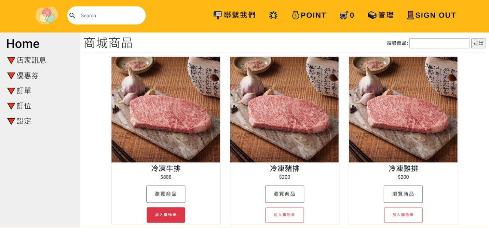

# 旅食Map

### **負責項目：會員商城/購物車/店家商城**
* 會員商城瀏覽功能(`java/com/goods`)
* 詳細商品瀏覽功能(`java/com/goods`)
* 購物車功能(`java/com/goods` , `java/com/goods/model/Cart`)
* 訂單/明細/查看(`java/com/order`)
* 店家商城增刪改查功能(`java/com/goods`)

### **使用技術**
* 前端：HTML、CSS、JavaScript(Bootstrap)
* 後端：Java、Servlet、JDBC、Hibernate
* 資料庫：MySQL、Redis

### **專題簡述**
 
* 購物商城中可用關鍵字搜尋找到商品
* 點選瀏覽商品查看商品詳情
* 點擊加入購物車，使用`Ajax`技術，避免畫面重新渲染
* 購物車品項使用`Redis`來儲存，使效能更佳化
* 按下結帳，成立一筆訂單，並且同步成立明細
* 店家商城可以進行增刪改查之管理

---

🔗專題PDF介紹：https://reurl.cc/n70vo1

🎞專題影片介紹：https://youtu.be/2C0t2nPfJi8

